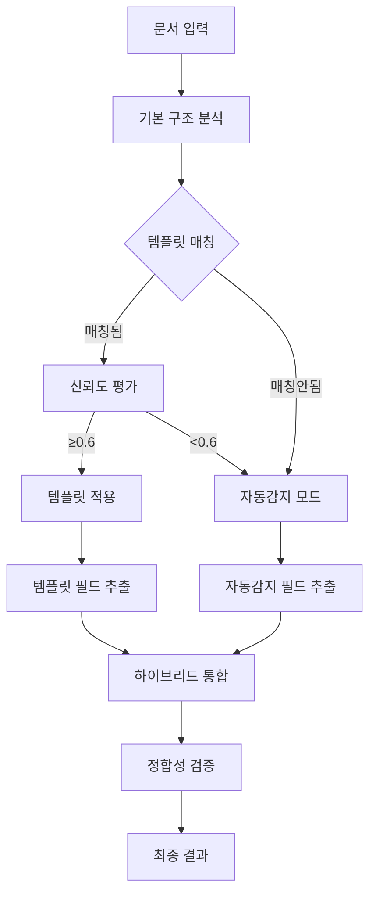

# 🎭 하이브리드 문서 처리 시스템 가이드

## 🔄 처리 플로우



## 🎯 템플릿 매칭 알고리즘

### 1. 문서 타입 인식
- 파일명 패턴 분석 (`기술기준`, `작업표준`, `절차서`)
- 내용 키워드 매칭
- 구조적 패턴 분석

### 2. 템플릿 후보 선별
```python
# 문서 타입이 일치하는 템플릿들 선별
candidates = [t for t in templates if t.document_type == detected_type]

# 구조적 유사도 계산
for template in candidates:
    similarity = calculate_structural_similarity(document, template)
    if similarity > threshold:
        # 매칭 후보로 추가
```

### 3. 신뢰도 계산
- **구조적 유사도** (40%): 섹션 구조, 필드 위치 유사성
- **내용 유사도** (30%): 키워드, 패턴 매칭
- **필드 매칭률** (30%): 템플릿 필드와 감지된 필드 일치도

## 🤖 하이브리드 통합 전략

### A. 필드 우선순위
1. **템플릿 필드** (높은 신뢰도로 매칭된 경우)
2. **자동감지 필드** (템플릿에 없는 새로운 필드)
3. **혼합 필드** (템플릿 + 자동감지 보완)

### B. 충돌 해결
```python
# 동일 위치에 템플릿 필드와 자동감지 필드가 있는 경우
if template_field.bbox.overlaps(auto_field.bbox):
    if template_confidence > auto_confidence:
        # 템플릿 필드 우선
        result_field = enhance_template_field(template_field, auto_field)
    else:
        # 자동감지 필드 우선
        result_field = enhance_auto_field(auto_field, template_field)
```

### C. 필드 보강
```python
# 템플릿 필드에 자동감지 정보 보강
template_field.extracted_value = auto_detected_value
template_field.confidence = max(template_conf, auto_conf)
template_field.metadata['hybrid_source'] = 'template+auto'
```

## 📊 성능 최적화

### 1. 캐싱 전략
- 템플릿 로드 캐싱
- 문서 구조 분석 결과 캐싱
- 매칭 결과 세션별 저장

### 2. 점진적 학습
- 성공적인 매칭 결과를 템플릿에 반영
- 사용자 수정사항을 템플릿 개선에 활용
- 통계 기반 신뢰도 조정

### 3. 성능 모니터링
```python
# 처리 결과 통계
{
    "template_usage": {
        "template_id": "b327e82c...",
        "usage_count": 15,
        "success_rate": 0.87,
        "avg_confidence": 0.73
    },
    "hybrid_performance": {
        "template_fields_used": 7,
        "auto_detected_fields": 3,
        "total_accuracy": 0.91
    }
}
```

## 🛠️ 설정 최적화

### 기본 설정
```python
config = PipelineConfig(
    enable_template_matching=True,      # 템플릿 매칭 활성화
    auto_apply_template=True,           # 자동 적용
    template_confidence_threshold=0.6,  # 60% 이상 신뢰도
)
```

### 고급 설정
```python
config = PipelineConfig(
    # 엄격한 템플릿 적용
    template_confidence_threshold=0.8,  # 80% 이상만 적용

    # 보수적 하이브리드
    auto_apply_template=False,          # 수동 확인 후 적용

    # 특정 템플릿 강제 사용
    custom_template_id="b327e82c-...",
)
```

## 🎯 실제 활용 시나리오

### 시나리오 1: 표준화된 기술기준 문서
- **상황**: 동일한 양식의 기술기준 문서들
- **설정**: `template_confidence_threshold=0.8` (엄격)
- **효과**: 95%+ 인식률, 일관된 구조 추출

### 시나리오 2: 유사하지만 변형된 문서
- **상황**: 기본 양식은 같지만 일부 필드가 다른 문서
- **설정**: `template_confidence_threshold=0.6` (유연)
- **효과**: 템플릿 필드 + 새로운 필드 자동감지

### 시나리오 3: 새로운 형식의 문서
- **상황**: 기존 템플릿과 다른 완전히 새로운 문서
- **설정**: 템플릿 매칭 실패 → 순수 자동감지 모드
- **효과**: 새로운 패턴 학습, 향후 템플릿 생성 가능

## 📈 품질 향상 전략

### 1. 템플릿 지속 개선
```bash
# 처리 결과 분석
python template_manager_cli.py stats

# 성능이 낮은 템플릿 개선
python template_manager_cli.py optimize [template_id]
```

### 2. 하이브리드 결과 검증
```python
# 결과 품질 체크
if result.template_match:
    template_accuracy = result.template_match.confidence
    hybrid_accuracy = calculate_hybrid_accuracy(result)

    if hybrid_accuracy > template_accuracy:
        # 하이브리드 방식이 더 우수
        suggest_template_update(result)
```

### 3. 사용자 피드백 반영
```python
# 사용자 수정사항을 템플릿에 반영
user_corrections = get_user_feedback(result)
template_manager.update_template_from_feedback(
    template_id, user_corrections
)
```