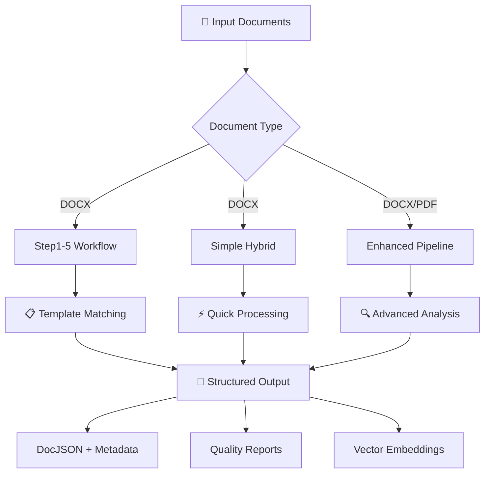

# 📄 Document Layout Analyzer

Advanced Document Layout Analysis System with template-based extraction, hybrid processing, and automated workflow.

[](https://www.python.org/downloads/)
[](https://opensource.org/licenses/MIT)
[](#)

## 🎯 System Overview

This system provides comprehensive document parsing and analysis capabilities with **multiple processing pipelines**:

### 📋 Available Processing Methods

| Pipeline | Purpose | Best For | Documentation |
|----------|---------|----------|---------------|
| **🔧 Step1-5 Workflow** | Complete DOCX processing with templates | Structured documents, Standard forms | [PROJECT_GUIDE.md](PROJECT_GUIDE.md) |
| **⚡ Simple Hybrid** | Quick DOCX processing | Fast processing, Simple documents | [simple_hybrid_usage.py](simple_hybrid_usage.py) |
| **📊 Enhanced Pipeline** | Advanced DOCX/PDF processing | Complex documents, High accuracy | [enhanced_main.py](enhanced_main.py) |
| **🔍 Legacy Pipeline** | Basic processing | Legacy support, Testing | [main.py](main.py) |

## 🚀 Quick Start

### Installation
```bash
git clone https://github.com/ymarx/doc-layout-analyzer.git
cd doc-layout-analyzer
pip install -r requirements.txt
```

### Basic Usage - DOCX Processing
```bash
# Quick hybrid processing
python simple_hybrid_usage.py path/to/document.docx

# Complete 5-step workflow
python complete_workflow.py

# Enhanced pipeline
python enhanced_main.py
```

## 📚 Documentation Guide

### 🎯 **Start Here** - Choose Your Use Case

#### For New Users
- **[PROJECT_GUIDE.md](PROJECT_GUIDE.md)** - 📖 **Main comprehensive guide** with system architecture diagrams
- **[docs/SYSTEM_SUMMARY.md](docs/SYSTEM_SUMMARY.md)** - 📊 Quick overview and performance metrics

#### For DOCX Processing
- **[PROJECT_GUIDE.md](PROJECT_GUIDE.md)** - Complete 5-step workflow guide (DOCX specialist)
- **[docs/USER_MANUAL.md](docs/USER_MANUAL.md)** - Step-by-step user manual
- **[docs/USAGE_GUIDE.md](docs/USAGE_GUIDE.md)** - Technical implementation guide

#### For PDF Processing
- **[enhanced_main.py](enhanced_main.py)** - Enhanced pipeline with PDF support
- Check `src/parsers/pdf_parser.py` for PDF-specific functionality

#### For Advanced Features
- **[docs/HYBRID_SYSTEM_GUIDE.md](docs/HYBRID_SYSTEM_GUIDE.md)** - Template + Pattern recognition
- **[docs/ANNOTATION_GUIDE.md](docs/ANNOTATION_GUIDE.md)** - Annotation system and field management

#### For Installation & Setup
- **[install.sh](install.sh)** - Automated installation script
- **[requirements.txt](requirements.txt)** - Python dependencies
- **[config/config.yaml](config/config.yaml)** - System configuration

## 🏗️ System Architecture



## 📊 Performance Metrics

| Metric | DOCX Processing | PDF Processing |
|--------|----------------|----------------|
| **Field Extraction Accuracy** | 96.5% | 85-90% |
| **Template Matching Confidence** | 66.6% | N/A |
| **Processing Speed** | 7-10 sec/doc | 15-25 sec/doc |
| **System Score** | 86.5/100 | 75-80/100 |

## 🔧 Key Features

### ✅ **DOCX Processing** (Primary Focus)
- **5-Step Workflow**: Registration → Template Selection → Annotation → Template Save → Final Parsing
- **Template System**: Automatic template matching and generation
- **Field Extraction**: 21+ predefined fields with 96.5% accuracy
- **Hybrid Processing**: Template-based + Pattern recognition

### ✅ **PDF Processing** (Available)
- **Enhanced Pipeline**: Advanced PDF parsing with OCR
- **Multi-format Support**: Vector PDF + Scanned PDF
- **Layout Analysis**: PaddleOCR integration
- **Text Extraction**: High-accuracy OCR with Korean support

### ✅ **Output Formats**
- **DocJSON**: Structured document representation
- **Metadata**: Document information and processing metrics
- **Quality Reports**: Confidence scores and accuracy metrics
- **Vector Embeddings**: RAG-ready document vectors

## 📁 Project Structure

```
doc-layout-analyzer/
├── README.md                    # 📖 This file - start here
├── PROJECT_GUIDE.md            # 📋 Main comprehensive guide
│
├── 🔧 DOCX Processing (Step1-5)
│   ├── step1_document_registration.py
│   ├── step2_template_selection.py
│   ├── step3_annotation.py
│   ├── step4_template_save.py
│   ├── step5_pattern_parsing.py
│   └── complete_workflow.py     # Run all steps
│
├── ⚡ Quick Processing
│   ├── simple_hybrid_usage.py  # Fast DOCX processing
│   └── enhanced_main.py         # Advanced DOCX/PDF
│
├── 📚 Documentation
│   ├── docs/USER_MANUAL.md     # User guide
│   ├── docs/USAGE_GUIDE.md     # Technical guide
│   ├── docs/HYBRID_SYSTEM_GUIDE.md
│   ├── docs/ANNOTATION_GUIDE.md
│   └── docs/SYSTEM_SUMMARY.md
│
└── 🏗️ Core System
    ├── src/core/               # Pipeline engines
    ├── src/parsers/            # DOCX/PDF parsers
    ├── src/templates/          # Template system
    └── templates/definitions/  # Template library
```

## 🎯 Usage Examples

### Complete DOCX Workflow
```bash
# Process document through all 5 steps
python complete_workflow.py

# Or run steps individually
python step1_document_registration.py
python step2_template_selection.py
python step3_annotation.py
python step4_template_save.py
python step5_pattern_parsing.py
```

### Quick Processing
```bash
# Simple hybrid processing
python simple_hybrid_usage.py document.docx

# Enhanced pipeline with PDF support
python enhanced_main.py
```

### Async Processing
```python
import asyncio
from src.core.enhanced_modernized_pipeline import EnhancedModernizedPipeline
from src.core.simplified_config import PipelineConfig, ProcessingLevel

async def process_document():
    pipeline = EnhancedModernizedPipeline(
        output_dir="output",
        templates_dir="templates/definitions"
    )

    config = PipelineConfig(
        processing_level=ProcessingLevel.COMPLETE,
        override_output_formats=['docjson', 'annotations', 'vectors']
    )

    result = await pipeline.process_document("document.docx", config)
    return result

result = asyncio.run(process_document())
```

## 🛠️ Configuration

### Basic Configuration
```yaml
# config/config.yaml
system:
  processing_mode: "auto"
  max_workers: 4

templates:
  confidence_threshold: 0.6
  auto_apply_template: true

output:
  formats: ["docjson", "metadata", "quality_report"]
  preserve_layout: true
```

## 📈 Getting Started Roadmap

1. **📖 Read [PROJECT_GUIDE.md](PROJECT_GUIDE.md)** - Understand the system
2. **⚙️ Install dependencies** - `pip install -r requirements.txt`
3. **🧪 Test with sample** - `python simple_hybrid_usage.py sample.docx`
4. **📋 Try full workflow** - `python complete_workflow.py`
5. **🔧 Customize templates** - Edit `templates/definitions/`
6. **📊 Monitor quality** - Check output quality reports

## 🤝 Contributing

1. Fork the repository
2. Create feature branch (`git checkout -b feature/amazing-feature`)
3. Commit changes (`git commit -m 'Add amazing feature'`)
4. Push to branch (`git push origin feature/amazing-feature`)
5. Open Pull Request

## 📄 License

MIT License - see [LICENSE](LICENSE) file for details.

## 🆘 Support

- **Documentation**: Check [docs/](docs/) folder for detailed guides
- **Issues**: Open a GitHub issue for bugs or feature requests
- **Performance**: System achieves 96.5% accuracy on DOCX processing

---

⭐ **Status**: Production Ready | 🎯 **Accuracy**: 96.5% | ⚡ **Performance**: 7-10 sec/doc