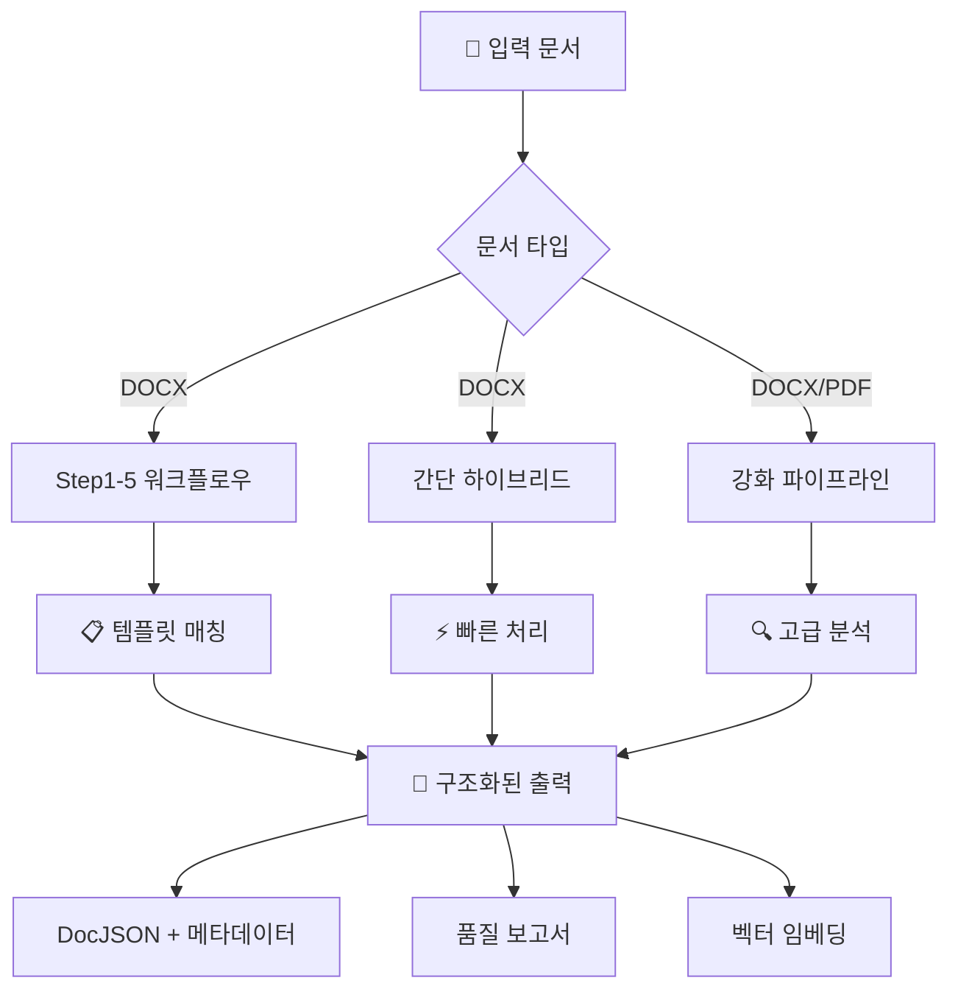

# 📄 문서 레이아웃 분석기

템플릿 기반 추출, 하이브리드 처리, 자동화 워크플로우를 제공하는 고급 문서 레이아웃 분석 시스템

[](https://www.python.org/downloads/)
[](https://opensource.org/licenses/MIT)
[](#)

## 🎯 시스템 개요

이 시스템은 **다중 처리 파이프라인**을 통해 포괄적인 문서 파싱 및 분석 기능을 제공합니다:

### 📋 사용 가능한 처리 방법

| 파이프라인 | 목적 | 최적 용도 | 문서 |
|----------|-----|----------|------|
| **🔧 Step1-5 워크플로우** | 템플릿 기반 완전한 DOCX 처리 | 구조화된 문서, 표준 양식 | [PROJECT_GUIDE.md](PROJECT_GUIDE.md) |
| **⚡ 간단 하이브리드** | 빠른 DOCX 처리 | 빠른 처리, 간단한 문서 | [simple_hybrid_usage.py](simple_hybrid_usage.py) |
| **📊 강화 파이프라인** | 고급 DOCX/PDF 처리 | 복잡한 문서, 높은 정확도 | [enhanced_main.py](enhanced_main.py) |
| **🔍 레거시 파이프라인** | 기본 처리 | 레거시 지원, 테스트 | [main.py](main.py) |

## 🚀 빠른 시작

### 설치
```bash
git clone https://github.com/ymarx/doc-layout-analyzer.git
cd doc-layout-analyzer
pip install -r requirements.txt
```

### 기본 사용법 - DOCX 처리
```bash
# 빠른 하이브리드 처리
python simple_hybrid_usage.py path/to/document.docx

# 완전한 5단계 워크플로우
python complete_workflow.py

# 강화 파이프라인
python enhanced_main.py
```

## 📚 문서 가이드

### 🎯 **여기서 시작** - 사용 목적에 따른 선택

#### 신규 사용자
- **[PROJECT_GUIDE.md](PROJECT_GUIDE.md)** - 📖 **메인 종합 가이드** (시스템 아키텍처 다이어그램 포함)
- **[docs/SYSTEM_SUMMARY.md](docs/SYSTEM_SUMMARY.md)** - 📊 빠른 개요 및 성능 지표

#### DOCX 처리
- **[PROJECT_GUIDE.md](PROJECT_GUIDE.md)** - 완전한 5단계 워크플로우 가이드 (DOCX 전문)
- **[docs/USER_MANUAL.md](docs/USER_MANUAL.md)** - 단계별 사용자 매뉴얼
- **[docs/USAGE_GUIDE.md](docs/USAGE_GUIDE.md)** - 기술적 구현 가이드

#### PDF 처리
- **[enhanced_main.py](enhanced_main.py)** - PDF 지원 강화 파이프라인
- `src/parsers/pdf_parser.py`에서 PDF 전용 기능 확인

#### 고급 기능
- **[docs/HYBRID_SYSTEM_GUIDE.md](docs/HYBRID_SYSTEM_GUIDE.md)** - 템플릿 + 패턴 인식
- **[docs/ANNOTATION_GUIDE.md](docs/ANNOTATION_GUIDE.md)** - Annotation 시스템 및 필드 관리

#### 설치 및 설정
- **[install.sh](install.sh)** - 자동 설치 스크립트
- **[requirements.txt](requirements.txt)** - Python 의존성
- **[config/config.yaml](config/config.yaml)** - 시스템 설정

## 🏗️ 시스템 아키텍처



## 📊 성능 지표

| 지표 | DOCX 처리 | PDF 처리 |
|-----|----------|----------|
| **필드 추출 정확도** | 96.5% | 85-90% |
| **템플릿 매칭 신뢰도** | 66.6% | N/A |
| **처리 속도** | 7-10초/문서 | 15-25초/문서 |
| **시스템 점수** | 86.5/100 | 75-80/100 |

## 🔧 주요 기능

### ✅ **DOCX 처리** (주요 기능)
- **5단계 워크플로우**: 등재 → 템플릿 선택 → Annotation → 템플릿 저장 → 최종 파싱
- **템플릿 시스템**: 자동 템플릿 매칭 및 생성
- **필드 추출**: 96.5% 정확도로 21개 이상 사전 정의 필드
- **하이브리드 처리**: 템플릿 기반 + 패턴 인식

### ✅ **PDF 처리** (사용 가능)
- **강화 파이프라인**: OCR을 통한 고급 PDF 파싱
- **다중 형식 지원**: 벡터 PDF + 스캔 PDF
- **레이아웃 분석**: PaddleOCR 통합
- **텍스트 추출**: 한국어 지원 고정확도 OCR

### ✅ **출력 형식**
- **DocJSON**: 구조화된 문서 표현
- **메타데이터**: 문서 정보 및 처리 지표
- **품질 보고서**: 신뢰도 점수 및 정확도 지표
- **벡터 임베딩**: RAG 준비된 문서 벡터

## 📁 프로젝트 구조

```
doc-layout-analyzer/
├── README.md                    # 📖 이 파일 - 여기서 시작
├── PROJECT_GUIDE.md            # 📋 메인 종합 가이드
│
├── 🔧 DOCX 처리 (Step1-5)
│   ├── step1_document_registration.py
│   ├── step2_template_selection.py
│   ├── step3_annotation.py
│   ├── step4_template_save.py
│   ├── step5_pattern_parsing.py
│   └── complete_workflow.py     # 모든 단계 실행
│
├── ⚡ 빠른 처리
│   ├── simple_hybrid_usage.py  # 빠른 DOCX 처리
│   └── enhanced_main.py         # 고급 DOCX/PDF
│
├── 📚 문서
│   ├── docs/USER_MANUAL.md     # 사용자 가이드
│   ├── docs/USAGE_GUIDE.md     # 기술 가이드
│   ├── docs/HYBRID_SYSTEM_GUIDE.md
│   ├── docs/ANNOTATION_GUIDE.md
│   └── docs/SYSTEM_SUMMARY.md
│
└── 🏗️ 핵심 시스템
    ├── src/core/               # 파이프라인 엔진
    ├── src/parsers/            # DOCX/PDF 파서
    ├── src/templates/          # 템플릿 시스템
    └── templates/definitions/  # 템플릿 라이브러리
```

## 🎯 사용 예시

### 완전한 DOCX 워크플로우
```bash
# 모든 5단계를 통해 문서 처리
python complete_workflow.py

# 또는 단계별 실행
python step1_document_registration.py
python step2_template_selection.py
python step3_annotation.py
python step4_template_save.py
python step5_pattern_parsing.py
```

### 빠른 처리
```bash
# 간단 하이브리드 처리
python simple_hybrid_usage.py document.docx

# PDF 지원 강화 파이프라인
python enhanced_main.py
```

### 비동기 처리
```python
import asyncio
from src.core.enhanced_modernized_pipeline import EnhancedModernizedPipeline
from src.core.simplified_config import PipelineConfig, ProcessingLevel

async def process_document():
    pipeline = EnhancedModernizedPipeline(
        output_dir="output",
        templates_dir="templates/definitions"
    )

    config = PipelineConfig(
        processing_level=ProcessingLevel.COMPLETE,
        override_output_formats=['docjson', 'annotations', 'vectors']
    )

    result = await pipeline.process_document("document.docx", config)
    return result

result = asyncio.run(process_document())
```

## 🛠️ 설정

### 기본 설정
```yaml
# config/config.yaml
system:
  processing_mode: "auto"
  max_workers: 4

templates:
  confidence_threshold: 0.6
  auto_apply_template: true

output:
  formats: ["docjson", "metadata", "quality_report"]
  preserve_layout: true
```

## 📈 시작하기 로드맵

1. **📖 [PROJECT_GUIDE.md](PROJECT_GUIDE.md) 읽기** - 시스템 이해
2. **⚙️ 의존성 설치** - `pip install -r requirements.txt`
3. **🧪 샘플로 테스트** - `python simple_hybrid_usage.py sample.docx`
4. **📋 전체 워크플로우 시도** - `python complete_workflow.py`
5. **🔧 템플릿 커스터마이징** - `templates/definitions/` 편집
6. **📊 품질 모니터링** - 출력 품질 보고서 확인

## 🤝 기여하기

1. 저장소 포크
2. 기능 브랜치 생성 (`git checkout -b feature/amazing-feature`)
3. 변경사항 커밋 (`git commit -m 'Add amazing feature'`)
4. 브랜치에 푸시 (`git push origin feature/amazing-feature`)
5. Pull Request 열기

## 📄 라이센스

MIT 라이센스 - 자세한 내용은 [LICENSE](LICENSE) 파일을 참조하세요.

## 🆘 지원

- **문서**: 자세한 가이드는 [docs/](docs/) 폴더를 확인하세요
- **이슈**: 버그나 기능 요청은 GitHub 이슈를 열어주세요
- **성능**: 시스템은 DOCX 처리에서 96.5% 정확도를 달성합니다

---

⭐ **상태**: 프로덕션 준비 완료 | 🎯 **정확도**: 96.5% | ⚡ **성능**: 7-10초/문서