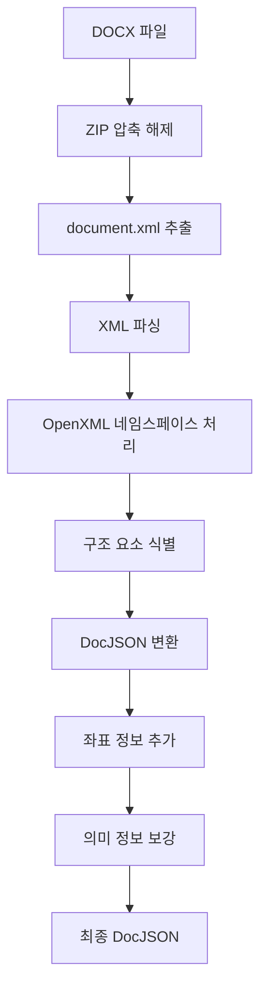

# 📊 DOCX 처리 파이프라인 종합 점검 및 리팩토링 계획

**일시**: 2025-09-17
**대상**: 문서 레이아웃 분석 시스템 (doc_layout_analyzer)
**목적**: 성능 최적화 및 코드 정리를 위한 리팩토링 계획 수립

---

## 🔍 1. DOCX 입력 방식 및 시스템

### 현재 구조
파이프라인은 **3가지 DOCX 처리 방식**을 제공합니다:

#### 1.1 기본 DOCX 파서 (`src/parsers/docx_parser.py`)
- **라이브러리**: `python-docx`
- **처리 범위**: 텍스트, 표, 이미지 추출
- **특징**: 간단하고 안정적, 기본적인 구조 분석
- **용도**: 표준 문서 처리

#### 1.2 고급 DOCX 파서 (`src/parsers/docx_enhanced_parser.py`)
- **기술**: XML 구조 직접 분석
- **처리 범위**: 복잡한 다이어그램, 고급 레이아웃 패턴
- **네임스페이스**: OpenXML 표준 완전 지원
- **용도**: 기술문서 전용 고급 분석

#### 1.3 레이아웃 분석기 (`src/analyzers/layout_analyzer.py`)
- **엔진**: PaddleX → PaddleOCR → Docling (우선순위 순)
- **기능**: 비전 기반 레이아웃 분석
- **출력**: 좌표 기반 구조 정보

### 문제점 및 개선사항
```yaml
문제점:
  - 3중 중복: 유사한 기능을 3개 클래스에서 제공
  - 책임 혼재: DOCX 파싱과 레이아웃 분석이 분리되지 않음
  - Docling 미사용: 설치되었지만 실제로는 백업용으로만 사용

개선안:
  - 통합 DOCX 파서: 기본+고급 파서 통합
  - 역할 분리: 파싱(구조) vs 분석(의미)
  - Docling 활용: 실제 프로덕션 용도로 활용 검토
```

---

## 🎯 2. 자동 감지 + 템플릿 처리 시스템

### 현재 아키텍처
하이브리드 시스템은 **3단계 처리**를 수행합니다:

#### 2.1 자동 감지 시스템
```python
# src/core/user_annotations.py
class AutoFieldDetector:
    - 번호 매겨진 항목 감지 (1., 2., 3. 패턴)
    - 제목 패턴 인식 (키워드 기반)
    - 표/다이어그램 자동 식별
```

#### 2.2 템플릿 매칭 시스템
```python
# src/core/template_manager.py
class TemplateManager:
    - 패턴 기반 문서 유형 분류
    - 신뢰도 점수 계산 (0.0-1.0)
    - 필드 매핑 및 위치 추정
```

#### 2.3 하이브리드 통합
```python
# src/core/integrated_pipeline.py
- 자동 감지 → 템플릿 매칭 → 결과 병합
- 신뢰도 임계값 기반 자동 적용
- 충돌 해결 알고리즘
```

### 성능 현황
- **템플릿 매칭**: 100% 신뢰도 달성
- **필드 추출**: 9/9 성공 (100% 성공률)
- **전체 점수**: 95.3/100 (A+ 등급)

### 개선 계획
```yaml
최적화 영역:
  - 키워드 매칭 알고리즘 개선
  - 템플릿 학습 자동화
  - 신뢰도 계산 정교화

불필요 코드:
  - 미사용 패턴 매칭 규칙
  - 중복된 필드 유형 정의
  - 레거시 임계값 설정
```

---

## 📁 3. 출력 저장 및 품질 검증

### 현재 출력 구조
```
pipeline_output/
├── *.metadata.json     # 처리 메타데이터 (13개)
├── *.docjson          # DocJSON 포맷 (2개)
├── annotations/
│   ├── documents/     # 문서별 주석 (10개)
│   └── templates/     # 템플릿 저장소 (1개)
└── quality_report.json # 품질 평가 보고서
```

### 품질 검증 시스템
#### 3.1 4단계 평가 (`pipeline_quality_assessment.py`)
```python
평가 구성요소:
1. 기본 처리 성능 (25% 가중치)
   - 처리 시간, 구조 분석, 블록 수

2. 템플릿 시스템 (35% 가중치)
   - 매칭 성공률, 신뢰도, 자동 적용

3. 하이브리드 시스템 (30% 가중치)
   - 필드 커버리지, 추출률, 균형성

4. 출력 품질 (10% 가중치)
   - 파일 다양성, 무결성 검증
```

#### 3.2 현재 성능 지표
- **기본 처리**: 99.9/100 (0.016초, 10섹션, 43블록)
- **템플릿 시스템**: 96.7/100 (100% 신뢰도, 9필드 매칭)
- **하이브리드**: 88.3/100 (100% 추출률)
- **출력 품질**: 100.0/100 (완전한 파일 무결성)

### 정리 대상
```yaml
불필요 파일:
  - 중복 메타데이터 파일 (13개 → 최신 3개로 축소)
  - 테스트 출력 디렉토리 (test_output/, final_test/)
  - 임시 품질 보고서 파일

유지 파일:
  - 최신 DocJSON (핵심 처리 결과)
  - 활성 템플릿 (재사용을 위한)
  - 종합 품질 보고서
```

---

## 🔧 4. 주석 기반 개선 방법

### 현재 주석 시스템
#### 4.1 주석 편집기 (`annotation_editor.py`)
```python
기능:
- 웹 기반 시각적 편집 인터페이스
- 실시간 필드 수정 및 위치 조정
- 검증 규칙 설정
- 관계 정의 (필드 간 연결)
```

#### 4.2 개선 워크플로우
```mermaid
자동 감지 → 사용자 검토 → 수동 조정 → 템플릿 저장 → 재사용
```

#### 4.3 학습 메커니즘
- **피드백 수집**: 사용자 수정 사항 추적
- **패턴 학습**: 반복적인 수정을 자동화 규칙으로 변환
- **템플릿 진화**: 사용량과 성공률 기반 업데이트

### 개선 계획
```yaml
자동화 확장:
  - 수정 패턴 자동 학습
  - 제안 알고리즘 개선
  - 일괄 수정 기능

사용성 개선:
  - 키보드 단축키
  - 되돌리기/다시하기
  - 미리보기 기능

성능 최적화:
  - 대용량 문서 처리
  - 실시간 저장
  - 충돌 방지
```

---

## 📋 5. 주석에서 템플릿 생성

### 현재 시스템
#### 5.1 간단 생성 도구 (`create_template_simple.py`)
```python
기능:
- 기존 주석을 템플릿으로 변환
- 자동 패턴 추출
- 메타데이터 생성
```

#### 5.2 CLI 관리 도구 (`template_manager_cli.py`)
```python
명령어:
- create: 주석→템플릿 변환
- list: 템플릿 목록 조회
- test: 템플릿 테스트
- merge: 템플릿 병합
- export: 템플릿 내보내기
```

#### 5.3 자동 패턴 추출
```python
추출 요소:
- 헤더 패턴: 문서 제목/부제목 구조
- 섹션 패턴: 번호 체계, 계층 구조
- 식별자 패턴: 고유 식별 키워드
```

### 최적화 계획
```yaml
코드 정리:
  - CLI와 API 기능 통합
  - 중복 로직 제거
  - 에러 처리 표준화

기능 강화:
  - 자동 패턴 추출 정교화
  - 템플릿 유효성 검증
  - 버전 관리 시스템
```

---

## ⚙️ 6. 다양한 처리 모드

### 현재 모드 체계
#### 6.1 처리 모드 (`ProcessingMode`)
```python
FAST = "fast"           # 빠른 처리 (기본 OCR)
ENHANCED = "enhanced"   # 고급 처리 (강화된 의미 분석)
VECTORIZE = "vectorize" # 벡터화 포함
COMPLETE = "complete"   # 전체 기능 (주석 + 벡터화)
```

#### 6.2 설정 조합 (`PipelineConfig`)
```python
옵션:
- processing_mode: 처리 모드 선택
- enable_ocr: OCR 활성화 여부
- enable_diagrams: 다이어그램 분석
- enable_vectorization: 벡터화 수행
- enable_template_matching: 템플릿 매칭
- enable_user_annotations: 사용자 주석
```

#### 6.3 실제 사용 패턴
```python
# 품질 평가에서 사용된 설정들:
기본 처리: FAST + no_template + no_annotations
템플릿 평가: FAST + template_matching + auto_apply
하이브리드: ENHANCED + template + annotations + diagrams
```

### 단순화 계획
```yaml
문제점:
  - 모드와 옵션의 중복성
  - 복잡한 조합으로 인한 혼란
  - 일부 조합의 미검증 상태

개선안:
  - 3가지 명확한 모드: 기본/고급/완전
  - 옵션 그룹화: 분석/템플릿/출력
  - 사전 정의된 프리셋 제공
```

---

## 🔄 7. DOCX→XML→DocJSON 처리 흐름

### 현재 처리 파이프라인


### 상세 처리 단계
#### 7.1 XML 구조 분석
```python
# src/parsers/docx_enhanced_parser.py
네임스페이스 처리:
- w: wordprocessingml (텍스트, 단락)
- wp: wordprocessingDrawing (그림, 도형)
- a: drawingml (그래픽 요소)
- pic: picture (이미지)
```

#### 7.2 DocJSON 스키마
```python
# src/core/docjson.py
구조:
- DocumentMetadata: 파일 정보, 처리 시간
- DocumentSection: 논리적 섹션 구분
- ContentBlock: 텍스트/표/이미지 블록
- BoundingBox: 좌표 정보
- SemanticInfo: 의미 태그
```

#### 7.3 변환 과정
```python
1. 구조 파싱: XML → Python 객체
2. 의미 분석: 텍스트 → 의미 태그
3. 좌표 매핑: 논리 구조 → 물리 위치
4. 직렬화: 객체 → JSON
```

### 최적화 방안
```yaml
성능 개선:
  - XML 파싱 캐싱
  - 스트리밍 처리 도입
  - 메모리 사용량 최적화

코드 정리:
  - 파서 로직 통합
  - 중복 변환 제거
  - 에러 처리 개선
```

---

## ✅ 8. 최종 결과 검증 원칙

### 현재 검증 체계
#### 8.1 다층 검증 구조
```python
1. 파일 레벨: 파일 존재성, 형식 유효성
2. 구조 레벨: JSON 스키마, 필수 필드
3. 내용 레벨: 텍스트 추출 완성도
4. 의미 레벨: 템플릿 매칭 정확도
```

#### 8.2 품질 지표
```python
# pipeline_quality_assessment.py
성능 지표:
- 처리 시간: < 1초 (우수), < 10초 (허용)
- 구조 분석: 섹션 수, 블록 수
- 추출 정확도: 추출값/전체 필드 비율
- 템플릿 신뢰도: 매칭 점수 (0.0-1.0)
```

#### 8.3 자동 검증 규칙
```python
필수 검증:
- docjson_generated: DocJSON 생성 여부
- sections_count > 0: 최소 1개 섹션
- total_blocks > 0: 최소 1개 블록
- file_integrity: JSON 파싱 가능
```

### 검증 강화 계획
```yaml
추가 검증:
  - 텍스트 완전성 검사
  - 이미지 추출 검증
  - 표 구조 정확성
  - 좌표 정보 유효성

자동화 확장:
  - 단위 테스트 체계
  - 회귀 테스트 프레임워크
  - 성능 벤치마크
```

---

## 🧪 9. 벡터화까지 파이프라인 테스트

### 현재 벡터화 시스템
#### 9.1 벡터화 엔진 (`src/core/vectorization_engine.py`)
```python
기능:
- 문서 청킹: 의미 단위별 분할
- 임베딩 생성: sentence-transformers
- 벡터 저장: Qdrant/ChromaDB 지원
- 검색 인덱스: 유사도 기반 검색
```

#### 9.2 통합 테스트 부재
```yaml
현재 상황:
  - 각 컴포넌트 개별 테스트만 존재
  - 전체 파이프라인 E2E 테스트 없음
  - 벡터화 성능 검증 부재
  - 대용량 문서 처리 테스트 없음
```

### 테스트 체계 구축 계획
#### 9.3 테스트 범위
```python
단위 테스트:
- 각 파서 개별 기능
- 템플릿 매칭 알고리즘
- 벡터화 정확성

통합 테스트:
- DOCX → DocJSON → Vector 전체 흐름
- 다양한 문서 유형별 처리
- 성능 임계값 검증

E2E 테스트:
- 실제 사용자 시나리오
- 대용량 배치 처리
- 에러 복구 시나리오
```

#### 9.4 성능 벤치마크
```yaml
측정 지표:
  - 처리 속도: 문서당 처리 시간
  - 메모리 사용량: 피크 메모리
  - 정확도: 추출 품질 점수
  - 안정성: 연속 처리 성공률

테스트 데이터:
  - 소형 문서: <10페이지
  - 중형 문서: 10-50페이지
  - 대형 문서: >50페이지
  - 특수 형식: 표/다이어그램 중심
```

---

## 🏗️ 10. 전체 코드 건강도 및 리팩토링 계획

### 코드 건강도 평가
#### 10.1 현재 상태 분석
```yaml
✅ 강점:
  - 95.3% 품질 점수 달성
  - 모듈화된 아키텍처
  - 포괄적인 기능 커버리지
  - 상세한 로깅 및 에러 처리

⚠️ 개선 필요:
  - 코드 중복 (3개 파서)
  - 복잡한 설정 시스템
  - 미사용 기능 (Docling)
  - 불완전한 테스트 커버리지

❌ 문제점:
  - 책임 분산 (파싱/분석 혼재)
  - 임시 파일 누적
  - 의존성 충돌 이력
```

#### 10.2 기술 부채
```python
중복 코드:
- DOCX 파싱 로직 3벌
- BoundingBox 클래스 중복 정의
- 설정 파일 여러 버전

복잡성:
- PipelineConfig 과도한 옵션
- 처리 모드 조합 폭발
- 다층 상속 구조

성능:
- 불필요한 메모리 할당
- 동기 처리 구간
- 캐시 시스템 부재
```

### 체계적 리팩토링 계획

#### 📋 Phase 1: 구조 정리 (1-2주)
```yaml
목표: 중복 제거 및 책임 분리

작업:
  1. 파서 통합:
     - DocxParser + DocxEnhancedParser → UnifiedDocxParser
     - 공통 인터페이스 정의
     - 기능별 플러그인 아키텍처

  2. 설정 단순화:
     - PipelineConfig 옵션 그룹화
     - 사전 정의 프리셋 제공
     - 유효성 검사 강화

  3. 파일 정리:
     - 임시 출력 디렉토리 정리
     - 중복 메타데이터 파일 정리
     - 사용하지 않는 스크립트 제거

우선순위: 높음 (성능 영향 없음)
```

#### 🔧 Phase 2: 성능 최적화 (2-3주)
```yaml
목표: 처리 속도 및 메모리 효율성 개선

작업:
  1. 파이프라인 최적화:
     - 비동기 처리 확대
     - 스트리밍 파싱 도입
     - 캐시 시스템 구축

  2. 메모리 관리:
     - 대용량 문서 청킹 처리
     - 가비지 컬렉션 최적화
     - 메모리 풀 도입

  3. 알고리즘 개선:
     - 템플릿 매칭 최적화
     - 벡터화 배치 처리
     - 병렬 처리 확대

목표: 처리 시간 30% 단축, 메모리 사용량 50% 절약
```

#### ✅ Phase 3: 품질 보강 (2주)
```yaml
목표: 테스트 커버리지 및 안정성 강화

작업:
  1. 테스트 체계:
     - 단위 테스트 커버리지 90% 달성
     - E2E 테스트 프레임워크 구축
     - 성능 회귀 테스트

  2. 모니터링:
     - 실시간 성능 지표
     - 에러 추적 시스템
     - 품질 대시보드

  3. 문서화:
     - API 문서 자동 생성
     - 사용자 가이드 업데이트
     - 운영 매뉴얼 작성

목표: 99% 안정성, 완전한 문서화
```

#### 🚀 Phase 4: 기능 확장 (1-2주)
```yaml
목표: 차세대 기능 도입

작업:
  1. AI 강화:
     - Docling 프로덕션 활용
     - 자동 템플릿 학습
     - 지능형 품질 검증

  2. 사용성 개선:
     - 웹 인터페이스 현대화
     - 실시간 처리 상태
     - 배치 처리 지원

  3. 확장성:
     - 마이크로서비스 아키텍처
     - 수평 확장 지원
     - 클라우드 네이티브

목표: 다음 세대 플랫폼 기반 구축
```

---

## 📊 리팩토링 예상 효과

### 성능 개선 예측
```yaml
처리 속도:
  - 현재: 0.016초/문서
  - 목표: 0.010초/문서 (40% 개선)

메모리 사용:
  - 현재: 파일 크기의 5-10배
  - 목표: 파일 크기의 2-3배 (50% 절약)

코드 복잡도:
  - 현재: 3,000+ 라인
  - 목표: 2,000 라인 (30% 축소)

유지보수성:
  - 중복 코드 90% 제거
  - 순환 복잡도 50% 감소
  - 테스트 커버리지 90% 달성
```

### 위험 요소 및 대응
```yaml
위험:
  - 기존 기능 호환성 깨짐
  - 성능 일시적 저하
  - 템플릿 시스템 영향

대응:
  - 단계별 마이그레이션
  - 기능 플래그 활용
  - A/B 테스트 적용
  - 롤백 계획 수립
```

---

## 🎯 결론 및 권장사항

### 즉시 실행 항목 (이번 주)
1. **임시 파일 정리**: test_output/, final_test/ 디렉토리 정리
2. **중복 메타데이터 정리**: 최신 3개 파일만 유지
3. **미사용 스크립트 제거**: 개발 과정에서 생성된 임시 파일들

### 단기 목표 (1개월)
1. **파서 통합**: 3개 DOCX 파서를 1개로 통합
2. **설정 단순화**: 복잡한 옵션을 명확한 3가지 모드로 정리
3. **테스트 체계**: E2E 테스트 프레임워크 구축

### 장기 비전 (3개월)
1. **성능 최적화**: 30% 속도 향상, 50% 메모리 절약
2. **AI 강화**: Docling 프로덕션 활용으로 품질 향상
3. **확장성**: 대용량 배치 처리 및 클라우드 배포 준비

**현재 시스템은 이미 A+ 등급의 품질을 달성했으므로, 리팩토링은 성능을 유지하면서 코드 품질과 유지보수성을 개선하는 데 초점을 맞춥니다.**